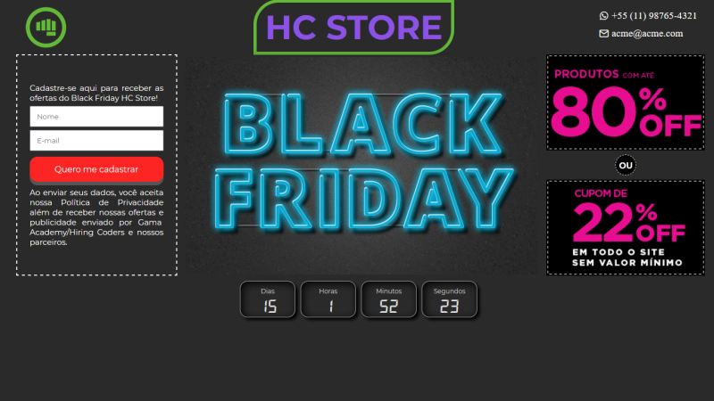

# Desafio #1 - Hiring Coders/[Gama Academy](https://www.gama.academy/) - [VTEX](https://vtex.com/)

## Deploy:

- Deploy na [Netlify](https://desafio1-hiring-coders-vtex.netlify.app/)
- Deploy na [Vercel](https://desafio1-gama-academy-hiring-coders.vercel.app/)
- Deploy no [Github Pages](https://eduardodarocha.github.io/Desafio1-Gama_Academy-Hiring_Coders/)

## Desafios:

- Landing page de promoções, estilo black friday;
- Cadastro de e-mail para receber promoções;
- Dados guardados no localstorage

